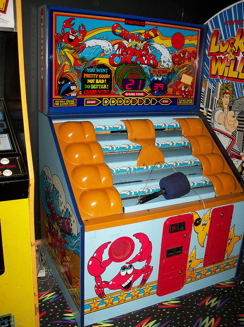
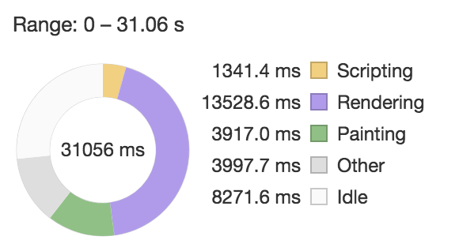
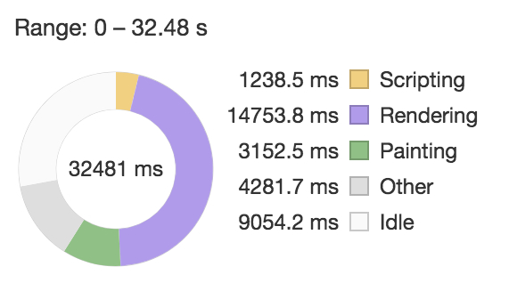
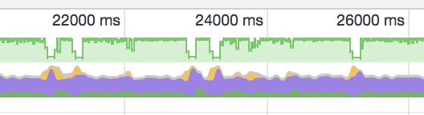
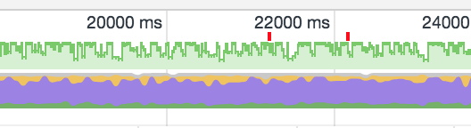
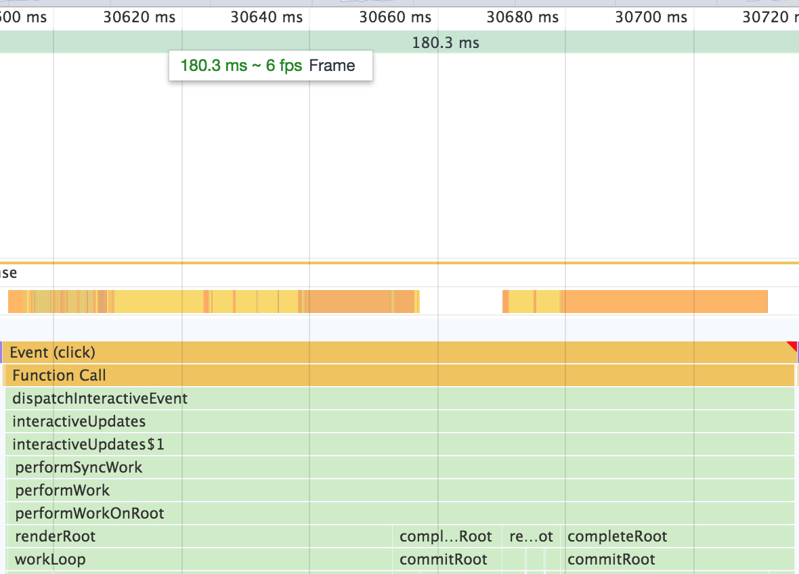

# Crab Trap - Alpha

[Live Site](https://codingwithkids.simeonsmith.me/crab-trap/build/index.html)

## Why I Made this Project

One of the challenges I find trying to become a better developer is finding time to learn new technologies. It often means sacrificing time with family and friends. I came up with the idea to build things that I can involve my family in.

In [Wes Bos's](https://twitter.com/wesbos) [JavaScript30 course](https://javascript30.com/) you build a whack-a-mole game. This reminded me of going to Chuck E. Cheese when I was young. There was a game where crabs would walk back and forth, hiding behind sand, while you tried to hit them with a hammer. I decided to take the idea of that game and make Crab Trap. While building it I got my son and wife's input on the illustrations and game mechanics.

[](https://www.flickr.com/photos/10707024@N04/16472236715)

> [Image from Scott on Flickr](https://www.flickr.com/photos/10707024@N04/16472236715)

## Project Technologies

To improve my knowledge of CSS animation I decided to hand code all the CSS animation and use SVG artwork. The state of the game is managed with [React](https://reactjs.org/) and I'm using the [create-react-app](https://github.com/facebook/create-react-app) bootstrapper. To handle transitions between components I'm using the [react-transition-group](https://github.com/reactjs/react-transition-group) library.

I created all the illustrations in [Affinity Designer](https://affinity.serif.com/en-us/designer/). Affinity Designer isn't as mature as Adobe Illustrator. Unfortunately it lacks some of the tools to make editing faster. However, it has all the illustration capabilities of Adobe Illustrator for only $50 per license and includes a year of free updates.

Most of the CSS I'm handling with [styled-components](https://www.styled-components.com/) but I do have a [SASS](https://sass-lang.com/) file for the crab's static CSS. Styled-components requires you to create two separate components, one for the React component and one for the styling. However, this results in two components in my code and in the React developer tools. Also, because you have to have two separate components you cannot use state to dynamically change your CSS. I'd love to hear if there's an alternative to this structure in styled-components.

Due to the issues with styled-components I'm considering switching to Zeit's [styled-jsx](https://github.com/zeit/styled-jsx). Styled-jsx allows you to put a style-like tag straight into your component. This keeps it as one component and gives you the ability to use state to determine the classes. This example comes from their documents and shows how it solves my issues with styled-components.

```javascript
export default () => (
  <div>
    <p>only this paragraph will get the style :)</p>

    { /* you can include <Component />s here that include
         other <p>s that don't get unexpected styles! */ }

    <style jsx>{`
      p {
        color: red;
      }
    `}</style>
  </div>
)
```

## Project Structure and Components

I'm organizing my project after the [structure suggested by Alexis Mangin](https://medium.com/@alexmngn/how-to-better-organize-your-react-applications-2fd3ea1920f1). I like this because it provides a organizational difference between components that are for pages, or scenes as Alexis refers to them, and components that could be used on any page. As suggested I also store any scene-specific components in the scenes folder under its own components folder.

The entire project comes together in [App.js](./src/App.js). This component stores the state for whether the game has started, if it's in fullscreen, and if the screen is rotated. These states determine whether the StartGame or GameBoard scene is shown.

The [StartGame](./src/scenes/StartGame/index.jsx) scene is the entry screen for the game. It allows the user to start a single player game. This changes the App's start game state to true and displays the [GameBoard](./src/scenes/GameBoard/index.jsx) scene.

I am using the react-transition-group to animate between the scenes. The transition between the two scenes was a bit tricky. When this change happens the StartGame scene animates out and the GameBoard scene animates in. Also a fullscreen request is made. However, the animations do not work well when they are running during the fullscreen change. Also, Chrome does not allow a fullscreen request to happen more than 1 second after the click. So the StartGame exit has to happen in one second. The fullscreen change takes a bit of time so the GameBoard enter animation has to be delayed so it doesn't happen while this change is made.

The [GameBoard](./src/scenes/GameBoard/index.jsx) scene is where all the game mechanics are brought together. The state for the difficulty, score, hiding spots, number of crabs, board initialization status, and paused state are controlled by this component.

The GameBoard creates a grid of spots. A certain percentage of these spots are hideable. The percentage range of spots that are hideable change with the difficulty. It also contains a number of crabs which walk from hiding spot to hiding spot. The speed and number of the crabs go up with the game difficulty as well.

The [hideable spots](./src/scenes/GameBoard/components/spots/) are shown by the four hiding spot images being display at their spot. These png images intercept the click through to the crab. The crab is also rendered un-clickable when it's paused behind the hiding spot. The 4 spots are [driftwood](./src/assets/images/drift-wood.png), [rocks](./src/assets/images/rock.png), a [sand castle](./src/assets/images/sand-castle.png), and a [turtle](./src/assets/images/turtle.png). The sand castle and turtle are programmed to show up approximately half as often to make them more unique.

When a [crab](./src/components/Crab/index.jsx) is clicked, the [bucket](./src/assets/images/bucket.png) animates down to trap it and the score counter ticks up. The crab is also rendered un-clickable to prevent multiple clicks on the same crab. Then both the crab and the bucket fade out. This is immediately replaced by a new crab which gets placed off the left or right of the screen at a random height.

When the score state changes the score animation is triggered. This is accomplished with the react-transition-group library as well. When you wrap any element with the CSSTransition component you can define the component that will be transitioning. This allows me to define one span component that wraps the score which is being displayed from state. It will then allow the old score span and the new score span to remain for a certain amount of time, defined by the `timeout={{ enter: 750, exit: 500 }}`.

```javascript
<TransitionGroup component="h2" className="score">
  Score:
  <CSSTransition component="span" key={score} classNames="number" timeout={{ enter: 750, exit: 500 }}>
    <span className="number">
      {score}
    </span>
  </CSSTransition>
</TransitionGroup>
```

The CSSTransition component also gives me classes which I can use in my CSS to make an animation. These class names are defined in the `classNames="number"` portion of the code. This acts as the prefix to a set of classes. When the span is entering it is first given a `number-enter` class and then immediately a `number-enter-active` class. This allows you to apply initial css using `.number-enter` and then any transition changes to `.number-enter-active`. Finally, once the time is up, it applies a `number-enter-done` class if you want to make changes for the final entry state. The same things happens for the unmounting component but with the suffixes of `-exit` and `-exit-active`. Since the component is gone at the end of the time there is no class with `-exit-done`.

The difficulty increases by 1 for every 10 points scored. The GameBoard is then re-initialized to accommodate the increase in hiding spots and crabs. The number of hiding spots and crabs gets capped out at a certain point due to screen size and to keep the processing load at a manageable level. However, the crabs continue to get faster at each difficulty.

## What I Learned

As most of you are probably aware, there are certain elements that browsers animate more smoothly than others. CSS values like widths, heights, top, right, bottom, left tend to have animation jank. This is because changing those types of CSS values actually change their position in the DOM. This can cause any other elements that depend on their position to have to move as well. This can be quite costly in terms of performance.

It is preferred to use transforms and transitions. They can be applied as values to the classes or in an animation. This is because they do not cause other element to reflow. These will give you a higher frame rate and smoother animation.

After doing some research I found that there are many articles stating that the 3D transforms perform the best. Transforms like the rotate3D (or the individual rotateX, rotateY and rotateZ.) However, all the articles I could find on the subject are at least 2 years old. One example is [here](http://blog.teamtreehouse.com/increase-your-sites-performance-with-hardware-accelerated-css).

So I decided to do some testing of my own. I had originally written my CSS animations with the standard rotate and translate. I ran a performance profile on the original code and then on the updated code. There was no discernable difference in the current version of chrome and both were actually using GPU acceleration. However, I imagine on older browsers you would see a performance boost.

The other thing my research turned up was that having fewer CSS selectors improved performance. So I went about making more specific selectors rather than chaining them together. After running performance tests before and after I found only a 0.5 seconds performance boost in the painting portion over 30 seconds.


> Before Selector Pairing


> After Selector Pairing

I was still having animation glitches, and the animations would only be visibly smooth on my laptop. My phone, while pretty decent, was still glitching. I ran another performance profile and found that styled-components was taking a long time to calculate styles.

Doing some research turn up the fact that [inline styles in React Native perform better than styled-components](https://medium.com/@jm90mm/a-quick-performance-comparison-of-styled-components-vs-inline-styles-in-react-native-21d8f6a561d7). So I decided to test this in React myself. I moved my static CSS for the crab to a SASS file. Running a performance profile on this showed no discernable change. I then moved all dynamic styling to inline styling. This removed all animation glitch from the crab. As you can see from the profile graphs below the frame rate bounces up and down more (green line) but it never gets as low as it did with styled-components.


> Before Moving Dynamic Styling to Inline


> After Moving Dynamic Styling to Inline

This resulted in a visually smoother animation. It appears that in general dynamic string interpolation is slower in all CSS in JS libraries. So in instances where you need a value to change on a regular basis, like my crabs' movement, it's better to do inline styles. You can see a thorough benchmark of the various CSS in JS frameworks [here](https://github.com/A-gambit/CSS-IN-JS-Benchmarks/blob/master/RESULT.md).

I still find that the animation can be janky on my phone. The higher difficulties with 6 crabs and the faster speed result in a problem. Typically I only notice when I've clicked on a crab and the bucket is animating down. As you can see, there is significant frame rate drop when the click events is fired.


> Frame Rate Drop when Crab is Clicked

I was aware that SVGs and CSS animations are probably not the best method for a game. This is echoed by my experiences at my job. I currently work as a graphic designer for an apparel manufacturer. We get quite large client files for garment art and then have to group them together in 5 yard sections. We then gang these into 70 yard runs.

From this experience I have found that a 250 MB raster-based file is way easier to work with than a 30 MB vector file. The raster file will take longer to load but when you start moving items around they are much friendlier. This is the same whether you are using GPU rendering or CPU rendering in Adobe Illustrator. For whatever reason, complex vector art takes more time to render than raster artwork.

## Where I am Going from Here

The performance issues so far prevent the game from running on my son's tablet. I have a feeling that I may not find any solution to this if I continue to use SVGs. However, I plan to see how well I can make this game perform with SVGs, at the very least as a proof of concept. There are several suggestions mentioned in [this article](https://css-tricks.com/browser-painting-and-considerations-for-web-performance/) from CSS Tricks I plan to implement. My React state management can use some refactoring to make it more efficient. I then need check to ensure that I'm not re-rendering when it's unnecessary using `componentShouldUpdate`.

Ultimately, I will probably switch to HTML 5 Canvas. While you plot points using vector coordinates in JavaScript the visual actually renders as raster. From my preliminary research [HTML 5 Canvas performs better than SVGs](https://www.sitepoint.com/canvas-vs-svg-choosing-the-right-tool-for-the-job/). Even if I do get it to work well on my son's tablet I would like it be smooth on many different devices.

Other than performance, I plan to add a multiplayer option. This will allow two people to see who can get to a certain number of points first. This will probably involve a timed or first-to-score end game. I plan to incorporate [Firebase](https://firebase.google.com/) to do this.

I will also be improving the UI and change animations. I would also like to add a timed/zen mode to the single player. The possibility of creating an app using React Native is something I also want to look into.

If you would like to hear about updates on this project I will be posting updates on my [Coding With Kids](https://www.simeonsmith.me/coding-with-kids/) blog.